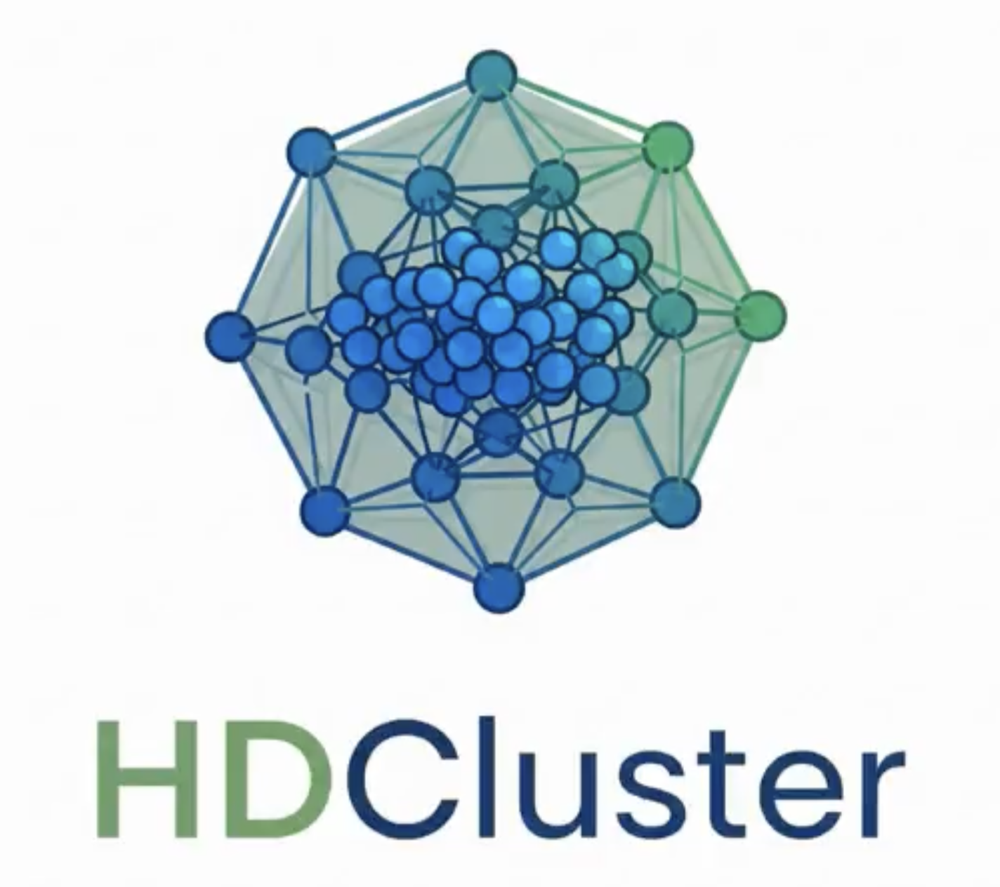

# HDCluster Data Analysis Support Videos

The following videos display the robustness of HDCluster.  An outlier between two clusters was introduced which narrowed the optimal merging threshold range. The algorithm was still able to successfully converge to the correct two cluster assignment, demonstrating stability against minor data variations. 

# Demo Baseline R1

   

# Demo Perturbed R1

